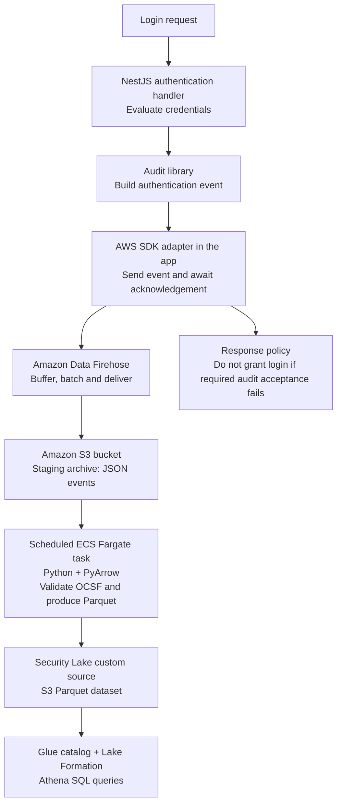
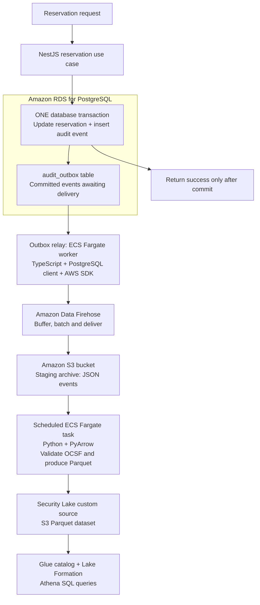

# Audit logging architectures and cost evaluation

Status: draft analysis for discussion, not an approved architecture decision or
a procurement estimate. Prepared 2026-09-14.

## Executive summary

The lab demonstrates a **custom AWS audit lake using S3 and Athena**, not Amazon
Security Lake. Application authentication events use a constrained OCSF contract;
using that standard does not imply using the managed Security Lake product.

The next evaluation should compare cost, durability, investigation speed, and
operational ownership. Start with three candidates:

1. An optimized version of the existing S3/Athena architecture.
2. A durability-hardened archive path with acknowledged acceptance or an outbox.
3. Amazon Security Lake for managed security-data integration.

Evaluate Loki or OpenSearch as an optional searchable hot copy, not automatically
as a replacement for the evidence archive. A cheaper pipeline and a stronger
audit trail are not equivalent unless their guarantees are made explicit.

This analysis inspected local infrastructure source and documentation, not live
AWS resources or billing. It does not establish current deployment status,
production readiness, or regulatory compliance. Prices must be refreshed for the
selected region and purchasing agreement before presenting a financial estimate.

## 1. Implemented architecture and repository ownership

The primary architecture repository is
[`movie-platform-infra`](https://github.com/movie-reservation-platform-lab/movie-platform-infra).
`movie-platform-environments` owns delivery and admission automation, rather than
the runtime audit storage pipeline.

```text
Application audit events
  -> stdout
  -> ECS FireLens / AWS for Fluent Bit
  -> validation and routing
  -> Amazon Data Firehose (Direct PUT)
  -> S3 archive (JSONL, GZIP)
  -> AWS Glue Data Catalog + Athena SQL queries

ALB access logs -------------------------> separate S3 bucket
CloudTrail write-management events ------> audit archive prefix

Ordinary application logs -> CloudWatch Logs
Application traces -> OpenTelemetry / ADOT -> X-Ray
Application metrics -> ADOT -> AMP / CloudWatch
Grafana -> investigation and visualization
```

Source references at the inspected infrastructure revision:

- [Architecture, diagram, delivery guarantees, and gaps](https://github.com/movie-reservation-platform-lab/movie-platform-infra/blob/6c6eedf1528b9707428611375e7cf45dfe7eadc4/docs/architecture/audit-and-observability.md)
- [AuditStack implementation](https://github.com/movie-reservation-platform-lab/movie-platform-infra/blob/6c6eedf1528b9707428611375e7cf45dfe7eadc4/lib/audit-stack.ts)
- [Fluent Bit routing configuration](https://github.com/movie-reservation-platform-lab/movie-platform-infra/blob/6c6eedf1528b9707428611375e7cf45dfe7eadc4/audit-router/platform.conf)
- [Application audit contract](https://github.com/movie-reservation-platform-lab/movie-platform-infra/blob/6c6eedf1528b9707428611375e7cf45dfe7eadc4/docs/contracts/platform-audit-v1.json)
- [Athena investigation queries](https://github.com/movie-reservation-platform-lab/movie-platform-infra/blob/6c6eedf1528b9707428611375e7cf45dfe7eadc4/docs/operations/audit-queries.sql)

These are historical source anchors, not a claim that the documentation describes
every subsequent application change. Consult the repository's current branch
when planning implementation.

### Component responsibilities

| Component | Responsibility |
| --- | --- |
| Fluent Bit through ECS FireLens | Collect, validate, buffer, and route records |
| Amazon Data Firehose | Batch and deliver application audit records to S3 |
| S3 | Store evidence objects |
| Glue Data Catalog | Describe schemas and partition locations; it is not the evidence store |
| Athena | Query the S3 files |
| CloudTrail | Capture configured AWS control-plane activity, not application login events |
| CloudWatch / X-Ray / Grafana | Operational investigation and visualization alongside audit evidence |

The application contract describes constrained **OCSF 1.3 Authentication events**,
not the whole OCSF standard. ALB and CloudTrail records remain in separate native
formats and tables. This is not a fully normalized security dataset.

### Correlation

- Stable audit event IDs connect responses, operational references, and archived
  events; they also provide a deduplication key.
- Request and correlation IDs connect application records for an action.
- Actual OpenTelemetry trace/span IDs connect events with logs and X-Ray.
- The captured ALB trace header bridges application records and ALB access logs.
  Its root is not assumed to equal the application's OpenTelemetry trace ID.
- CloudTrail event IDs, principals, and resource identifiers support a separate
  AWS configuration/activity investigation path.

Correlation is not an assurance that every trace was sampled or retained for as
long as the audit record. Multiple distinct audit events can share a trace ID.

## 2. Existing guarantees and limitations

The implemented pipeline is useful security audit logging, but is not lossless
or administrator-proof evidence:

- A successful stdout write does not acknowledge Firehose or S3 persistence.
- The router buffers on task-local storage. Task loss, exhausted buffers, or a
  prolonged delivery failure can lose undelivered events.
- Retries can produce duplicates; consumers must deduplicate by event identity.
- The current archive is encrypted and versioned, but does not use S3 Object Lock.
- Application containers share a task role, limiting producer isolation.
- Archive and ALB objects default to 30-day current-object retention. Noncurrent
  versions can remain billable beyond that interval. Query results expire sooner.

For a database-backed business mutation that must have durable audit evidence,
evaluate committing an audit outbox record in the same transaction. A relay can
then publish with retries. Adding Kinesis downstream of stdout alone does not
close the failure window before durable acceptance.

An outbox addresses atomic recording; transport, archive retention, access
isolation, reconciliation, and recovery still require their own design. Failed
attempts without a committed business transaction need an explicit recording
policy too. See the [AWS transactional outbox pattern](https://docs.aws.amazon.com/prescriptive-guidance/latest/cloud-design-patterns/transactional-outbox.html).

## 3. Candidate architectures

These options operate at different layers and can be combined. Fluent Bit is a
collector, a stream is a transport, and Security Lake is a managed security-data
lake. They are not interchangeable products.

| Approach | Reason to consider it | Cost drivers and tradeoffs |
| --- | --- | --- |
| Current: Fluent Bit -> Firehose -> S3/Athena | Simple managed delivery and occasional SQL investigation | Collector resources, Firehose ingestion, storage, requests, queries, endpoints; existing producer durability gap |
| Fluent Bit -> S3 directly -> Athena | Remove Firehose from delivery | Potential delivery savings; greater ownership of buffering, uploads, recovery, object sizing, and monitoring |
| Durable producer/outbox -> Kinesis -> archive and consumers | Replay, independent consumers, near-real-time processing | Database/relay overhead, stream capacity or usage, reads, retention, consumers, archive delivery |
| Amazon Security Lake -> Athena/security tools | Managed security-source integration and normalization | AWS-source ingestion/normalization, underlying services, storage, custom-source preparation, queries |
| CloudWatch-first | Operational search using familiar AWS tooling | Ingestion, retained bytes, query scanning, and optional forwarding/archive duplication |
| S3 archive + Loki/OpenSearch/managed hot search | Faster interactive investigation | Additional ingestion/indexing, compute, hot retention, replication, and operations |

### Direct-to-S3 collection

Fluent Bit has an [S3 output](https://docs.fluentbit.io/manual/data-pipeline/outputs/s3).
Evaluate its actual buffering and upload semantics under process/task failure,
including persistent storage requirements and small-object behavior. Removing a
managed service removes its fee, not its responsibilities.

### Streaming transport

Kinesis Data Streams adds retained, replayable data and independent consumers.
Its cost depends on capacity mode, ingestion, retrieval, retention, and consumer
configuration. It is distinct from the Firehose Direct PUT path already used.
See [Kinesis pricing](https://aws.amazon.com/kinesis/data-streams/pricing/).

Kafka/MSK belongs on the extended shortlist if the organization already operates
Kafka or needs its ecosystem. Do not introduce a new broker platform merely on
the assumption that it makes a small logging deployment cheaper.

### Amazon Security Lake

Security Lake is a separate managed service. Its pricing distinguishes
AWS-source ingestion and normalization. AWS currently states that bringing your
own or third-party data has no Security Lake ingestion charge; this does **not**
make custom ingestion free overall. Storage, supporting services, queries, and
your transformation pipeline remain chargeable.

Custom sources must meet OCSF and Parquet requirements. Our constrained JSONL
archive cannot simply be relabeled as a Security Lake custom source.
See [Security Lake pricing](https://aws.amazon.com/security-lake/pricing/) and
[custom-source requirements](https://docs.aws.amazon.com/security-lake/latest/userguide/custom-sources.html).

### Proposed Security Lake migration: components and durability

This is a proposed architecture, not an implemented or approved migration.
**Security Lake is the destination; durable delivery must be designed before
events reach it.** Distinguish standalone authentication decisions from events
that must commit atomically with a business database mutation. The following two
designs reuse Firehose and share a staging archive and publisher implementation;
they do not have identical durability guarantees.

#### Authentication event without a business database mutation

Example: credentials are evaluated and an authentication rejection is recorded.
There is no reservation change to commit alongside it.



The application explicitly awaits Firehose acceptance. Stdout collection through
Fluent Bit cannot provide that remote acknowledgement to the application.
However, Firehose acceptance is **not** proof of permanent archival: buffering
and retries are bounded, and delivery failures require monitoring and recovery.
See [Firehose delivery troubleshooting](https://docs.aws.amazon.com/firehose/latest/dev/troubleshooting.html).

A crash before submission can still lose the authentication decision. If every
accepted authentication attempt must be recoverable, persist an attempt record
before evaluation and then its outcome in a dedicated audit journal, with retry
delivery. That can use database storage even though there is no business
mutation. The direct-delivery variant alone does not meet that stronger
requirement. An acknowledged decision is also not proof that a session was
subsequently issued; model those as separate facts when needed.

#### Database mutation with a transactional outbox

Example: confirming a reservation. The business change must not commit without
its audit event.



The arrows inside the database describe one atomic transaction, not independent
writes. Database commit is the first durable boundary. If the application
crashes afterward, the event remains in the outbox. Firehose acceptance and S3
archival must be tracked as separate delivery states; keep the outbox recoverable
until archival is confirmed before cleanup. Confirmation requires an explicit
reconciliation mechanism using archived event IDs, not just a successful
Firehose API response.

Account boundaries are omitted for readability. A separate security/audit
account is a proposed isolation measure, not a claim about the current demo.
Operational logs and traces remain on their separate Fluent Bit / CloudWatch /
ADOT / X-Ray path in both designs.

#### Concrete implementation choices

| Responsibility | Initial implementation | Custom work required |
| --- | --- | --- |
| Outbox relay | TypeScript worker on ECS Fargate, using a PostgreSQL client and AWS SDK; scheduled Lambda is an alternative | Claim committed rows, send events, handle partial failures, retry, and track acceptance and archival separately |
| S3 staging archive | Amazon S3 bucket populated by Amazon Data Firehose | Configure permissions, encryption, retention, delivery monitoring, and replay access |
| Security Lake publisher | Python task on ECS Fargate using PyArrow, launched by EventBridge Scheduler | OCSF validation, batching, partitioning, Parquet generation, uploads, publication checkpoints, and restricted quarantine |

These are implementation candidates, not provisioned resources. PyArrow supplies
[Parquet writing](https://arrow.apache.org/docs/python/parquet.html), not OCSF
business mappings or the recovery workflow. The publisher should collect
unpublished staging inputs into appropriately sized batches, rather than create
a lake file for each individual event. Persist its input/output checkpoints and
handle late inputs and overlapping runs safely.

An existing CDC implementation is another relay option:
[Debezium's outbox event router](https://debezium.io/documentation/reference/stable/transformations/outbox-event-router.html)
captures outbox changes, while
[AWS DMS can deliver change records to Kinesis](https://docs.aws.amazon.com/dms/latest/userguide/CHAP_Target.Kinesis.html).
Neither removes the need for OCSF publication and recovery design. Evaluate their
operational and cost overhead before replacing a small polling worker.

#### What each component does

| Component | Responsibility |
| --- | --- |
| Application emission points | Decide what actually happened: login rejected, reservation confirmed, permission changed. Emit where the outcome is known, not merely when HTTP returns 200. |
| Audit library | Construct a versioned event with a stable event ID, actor, action, target, outcome, timestamp, and correlation IDs. Exclude passwords, tokens, and unnecessary personal data. |
| Database outbox | Persist an audit event before acknowledging the audited operation; a durable outgoing mailbox. |
| Background relay | Read committed events, submit them to Firehose, retry after failures or restarts, and track downstream archival separately. |
| S3 staging archive | Preserve accepted events for repair and replay without requiring the application to emit them again. Apply explicit access and retention policies. |
| Security Lake publisher | Map and validate the agreed OCSF schema, create partitioned Parquet batches, and checkpoint publication. |
| Security Lake, catalog, and Athena | Organize the dataset, govern access, and provide SQL investigation over stored events. |

For custom sources, the publisher must supply OCSF-formatted Parquet; Security
Lake does not automatically convert our application JSON. Different OCSF event
classes require separate custom sources. Authentication is one class; reservation
and administrative activity need deliberate mappings rather than being labelled
as authentication. Follow the supported schema versions, partitioning, sorting,
and batch requirements in the
[custom-source documentation](https://docs.aws.amazon.com/security-lake/latest/userguide/custom-sources.html).

Keep the library's business-facing API independent of S3, Parquet, and AWS
permissions. NestJS middleware can capture request context; the authentication
decision or application use case supplies the event's meaning. For database
mutations, the outbox adapter must participate in the caller's transaction. Neither
the direct-delivery nor the outbox adapter may reuse
the existing stdout sink's local-acceptance receipt as a durability guarantee.

#### Database changes and authentication decisions

For an audited business mutation, commit the change and its audit event together:

```text
BEGIN TRANSACTION
  Save the confirmed reservation
  Insert "reservation confirmed" into audit_outbox
COMMIT
```

Both succeed, or neither succeeds. If the process crashes after commit, the
outbox event remains available for the relay. This closes the failure window
between committing a business change and separately emitting its audit event.
It is the
[transactional outbox pattern](https://docs.aws.amazon.com/prescriptive-guidance/latest/cloud-design-patterns/transactional-outbox.html),
not a guarantee that downstream delivery is instantaneous or duplicate-free.

Handle the other cases explicitly:

- **Rejected login or failed operation:** use the standalone delivery path, or
  a dedicated audit transaction when stronger durability is required. An event
  inside a rolled-back business transaction disappears too.
- **Successful login:** require the selected acceptance boundary before issuing
  a successful response/session. Firehose acceptance and database journal
  persistence offer different guarantees. Specify what happens if acceptance is
  unavailable; for audit-critical actions, reject or defer the action. A failed
  login must never become successful because auditing failed.
- **Direct database access:** application events cannot capture an administrator
  running SQL outside the application. Database-native auditing is a separate
  source to collect and normalize. Row-change capture alone does not explain
  human intent or capture every read.

#### Durability rules and acceptance boundaries

**Do not discard the previous durable copy before the next durable destination
acknowledges receipt.** Database commit, Firehose acceptance, S3 archival, and
lake queryability are different milestones. The direct authentication variant
has no initial database copy; its limitations must not be presented as outbox
guarantees.

1. Store the outbox in a database that survives ECS task deletion, not solely in
   container-local storage. Define availability, backups, restore testing, and
   acceptable recovery-point objectives.
2. Track Firehose acceptance separately from confirmed S3 archival, and do not
   delete the last outbox copy based only on Firehose acceptance. Checkpoint
   publication only after successful output writes. Use stable object/batch
   identities so a crash between a write and its checkpoint can be retried safely.
3. Preserve event IDs across retries. Expect at-least-once processing and make
   consumers idempotent. Deduplicate by event ID, never by trace ID.
4. Retain staging data long enough to recover from publisher outages. Define
   outbox cleanup, archive retention, and capacity limits; do not silently expire
   pending events when a backlog grows.
5. Monitor oldest undelivered event, backlog, failures, quarantine, and missing
   publication batches. Reconcile produced, accepted, and published event IDs.
   A quarantine is an actionable recovery path, not successful publication;
   never copy credentials into it for debugging.
6. Separate writer, reader, and administrator permissions. If immutable retention
   is required, design a protected archive explicitly. Durability against crashes
   and resistance to deliberate deletion are different requirements.

For durably recorded events, the intended result is **at-least-once delivery with
deduplication and recovery**, not an end-to-end exactly-once claim. Direct
authentication delivery does not cover a crash before submission. Test crashes
before and after each handoff,
duplicate deliveries, extended outages, invalid schemas, replay, and restoration.

#### Migration from Fluent Bit and Firehose

The smallest compatibility pilot keeps the existing
`stdout -> Fluent Bit -> Firehose -> S3` path and adds the Security Lake publisher
after S3. It changes the destination but does not fix losses before S3 acceptance.

The two proposals above retain Firehose for managed batching and delivery.
Fluent Bit remains useful for ordinary operational logs, but is not the
authoritative acceptance boundary for either audit path. The outbox relay could
instead write directly to S3, taking ownership of batching and upload recovery;
Firehose is not mandatory. Add SQS or Kinesis only when scale, isolation, replay,
or additional consumers justify another component.

Keep implementation slices separate: first validate Security Lake publication
using sanitized fixtures or existing archived events, then implement and
failure-test the durable producer/outbox path. Do not describe the migration as
durable until that path is verified. Both slices remain subject to the workload
and cost evaluation below.

### Search layer

Compare [CloudWatch](https://aws.amazon.com/cloudwatch/pricing/),
[OpenSearch](https://aws.amazon.com/opensearch-service/pricing/), and
[Grafana Cloud](https://grafana.com/pricing/) against the same investigation
workload. For self-hosted Loki, include infrastructure, upgrades, backups,
availability, and on-call effort rather than treating open-source software as
zero-cost operation.

Keep the searchable copy rebuildable from the archive if the archive is intended
to be the authoritative evidence store. A preferred query UI does not by itself
establish durability or retention guarantees.

## 4. Pricing mechanics that matter

### Collector capacity

Fluent Bit does not introduce a per-GB hosted-service fee by itself. Its costs are
CPU, memory, buffering storage, networking, and maintenance.

The documented demo allocates 128 CPU units and 256 MiB to its router inside an
existing 2-vCPU/4-GiB Fargate task. This did not increase that task's configured
size, but consumes capacity available to applications. Measure whether collection
forces larger tasks or more instances at the target throughput.

### Small-record rounding in Firehose

For the implemented Direct PUT path, Firehose ingestion uses 5-KiB record
increments. API batching does not eliminate rounding of individual records.
GZIP compression of the S3 output occurs after ingestion.
See [Firehose pricing](https://aws.amazon.com/firehose/pricing/) and
[the documented 5,120-byte billing increment](https://docs.aws.amazon.com/firehose/latest/dev/limits.html).

Illustrative payload calculation, not a regional price quote:

```text
100 events/second * 30 days = 259.2 million events

Assuming exactly 1 KiB per submitted record:
  raw payload:                 approximately 247 GiB/month
  rounded ingestion quantity: approximately 1,236 GiB/month
```

Use the actual submitted record-size distribution, including framing, in a real
estimate. Do not multiply an S3 compressed-byte measurement by an ingestion rate.
Verify each service's billing units rather than mixing decimal GB and binary GiB.

### Storage and queries

Model retained compressed bytes separately from ingestion. Include current and
noncurrent versions, S3 requests, lifecycle transitions, retrieval, and any
replication or duplicate hot copy. Model startup accumulation separately from
steady-state retention.

Query cost depends on the selected query engine/pricing mode and workload. For
Athena scan-based SQL pricing, measure scanned bytes for realistic queries;
partitioning, columnar formats, and compaction can change this materially.
Conversion and compaction also have costs and should not be assumed free.
See [S3 pricing](https://aws.amazon.com/s3/pricing/) and
[Athena pricing](https://aws.amazon.com/athena/pricing/).

### Fixed and shared costs

Private interface endpoints can incur hourly and data-processing charges even
at low audit traffic. Separate audit-specific resources from shared networking,
application compute, dashboards, operational logs, and traces. Do not attribute
the whole lab bill to the audit pipeline.
See [PrivateLink pricing](https://aws.amazon.com/privatelink/pricing/).

Also account for selected encryption/key management, monitoring, CloudTrail
configuration, cross-region transfer, support, and operational labour. A stream
or self-hosted search service can introduce a baseline cost absent from a mostly
usage-priced archive.

## 5. Reproducible evaluation method

### Establish one workload sheet

Record these inputs per source, not just as one blended log volume:

- Average and peak events/second, burst duration, and growth forecast.
- Record-size distribution and measured compression ratio.
- Application audit, CloudTrail, ALB, and any proposed WAF/VPC/DNS sources.
- Hot and archival retention; versioning, immutability, and residency requirements.
- Queries/day, scanned time windows, selectivity, and concurrent investigators.
- Acceptable event visibility delay, recovery time, and loss tolerance.
- Replay period, ordering requirements, and number of independent consumers.
- Accounts, regions, availability zones, and replication requirements.

Run low/base/high scenarios, for example 10, 100, and 1,000 events/second.
These are sensitivity scenarios, not measured lab traffic or business forecasts.
Use identical guarantees and retention when comparing architecture totals.

### Cost model

```text
Monthly infrastructure cost =
  collection + transport + transformation
  + storage + queries/search
  + networking + security/monitoring services

Total ownership cost =
  infrastructure + recurring operational labour
  + separately identified implementation/migration cost
```

Track quantities and unit prices independently. For example:

```text
Monthly events = average events/second * seconds in the modelled month
Ingestion quantity = sum of per-record billable sizes
Steady retained bytes ~= compressed bytes/day * effective retention days
Query scan quantity = sum of bytes scanned by representative monthly queries
```

The retention approximation needs adjustments for versions, duplicate copies,
growth, lifecycle transitions, and the first-month ramp. Include retries and
reprocessing where material.

### Pricing and measurement steps

1. Build estimates in [AWS Pricing Calculator](https://calculator.aws/) using
   eu-central-1 consistently unless another region is explicitly in scope.
2. Record the pricing date, currency, billing units, tax treatment, discounts,
   support allocation, and source URLs. Keep trials and credits separate.
3. Show idle baseline, expected monthly cost, burst sensitivity, first-month
   storage, and mature-retention storage.
4. Replay representative sanitized events through each candidate. Measure
   collector overhead, throughput, delivery lag, object sizes, and compression.
5. Run the same investigation queries and measure latency and scanned bytes.
6. Test downstream outages, collector/task termination, buffer exhaustion,
   duplicates, replay, and recovery. Reconcile produced, accepted, and archived IDs.
7. Compare observed billing by service and usage type with the model. Explain
   discrepancies rather than extrapolating the small demo bill directly.

Suggested workbook tabs: assumptions, measured workloads, unit prices,
architecture line items, sensitivity scenarios, benchmark results, and risks.

Suggested leadership comparison columns: monthly infrastructure cost, operating
hours/month, implementation effort, visibility delay, durability boundary,
retention/isolation guarantees, and confidence in the estimate.

## 6. Open decisions and next work

Before selecting an architecture, answer:

- Is this primarily operational investigation or an authoritative audit trail?
- Which events must be durably recorded before an operation succeeds?
- Which sources, accounts, and retention periods are actually required?
- Is occasional SQL sufficient, or is fast interactive search a requirement?
- Are replay and multiple independent consumers required?
- Is an existing organizational Kafka, SIEM, or logging platform available?
- What are the team's operational capacity and monthly budget?

Recommended next slice: collect a representative workload and produce the shared
pricing worksheet before implementing a migration. Keep OCSF standardization,
delivery durability, archive protection, and search experience as distinct
decisions, even when a managed product helps with several of them.

This document intentionally approves no deployment, retention change, new
service, migration, or claim of compliance.
