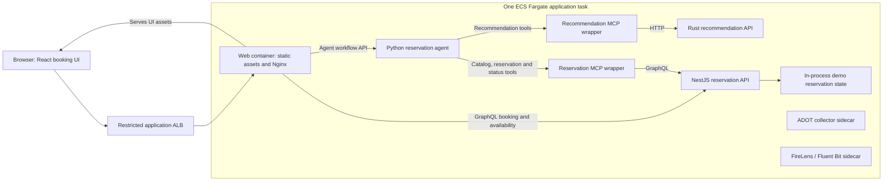
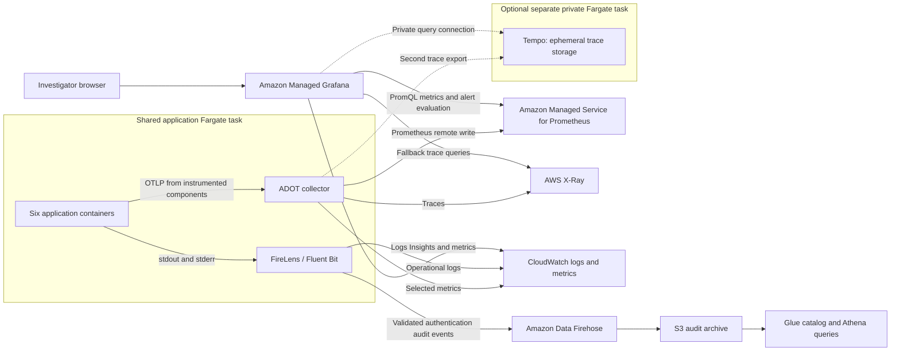

# SRE exercise: platform and investigation guide

You are investigating a synthetic incident in a movie-booking application.
Explain user impact, follow evidence across dependencies, propose a safe mitigation
and describe how to verify recovery. You do not need to guess a hidden trick or
rebuild the environment.

**Access is investigation-only.** Use your own assigned identity for Grafana and
scoped AWS inspection. Public source needs no repository membership. The
facilitator performs approved changes; do not deploy, restart tasks, alter IAM,
retrieve secrets, run ECS Exec or delete resources.

Before starting, obtain from the facilitator:

- The application, dashboard, alert and Explore links, plus permitted AWS console
  entry points. Live addresses are intentionally not published here.
- The selected service revisions/image digests and infrastructure revision.
- The incident time window, expected user journey and time budget.
- Confirmation of available data sources and any instrumentation/access gaps.

This is an architecture guide, **not evidence of what is running now**. Source
references below are inspected baselines; the demonstrated release takes
precedence. Report missing access or telemetry rather than working around it.

## 1. Request flow and deployment boundary

There are **six application containers plus two sidecars**, not six independently
deployed ECS services. Containers in this task communicate over task-local
networking. The browser reaches Nginx through the ALB; it does not directly reach
private API/MCP ports. ADOT and FireLens are shown for placement; their paths are
in the next diagram.

The manual booking path uses the reservation API. Agent-assisted booking first
obtains recommendations, then uses reservation tools to select a screening,
request a seat and poll its result. The demo agent is a deterministic orchestration
path; the repository name does not imply a live external LLM dependency here.

The demonstrated composition uses in-process reservation state and an in-process
worker, not a durable database. Reloading the browser should read current state,
but task replacement can discard it. A task restart can affect all application
components and erase useful evidence. Health/readiness checks are separate from
the user workflow and do not prove successful booking.

## 2. Signals, storage and investigation tools

Solid arrows show baseline routing. Dashed arrows identify the optional Tempo
addition, which the facilitator must confirm is deployed and working.

| Signal | What to use | Important limitation |
| --- | --- | --- |
| Metrics | AMP PromQL in Managed Grafana | Scope to the supplied environment/service/route; a metric alert identifies a time window, not one trace. |
| Traces | Tempo when confirmed available; X-Ray otherwise | Not every component/hop is instrumented. Missing spans are not proof a dependency was never called. |
| Operational logs | CloudWatch Logs Insights, including through Grafana | Trace/log navigation is manual in this version; some events have only request/correlation IDs. |
| Audit events | Separate Firehose → S3 → Glue/Athena path, if included in your authorized exercise | This custom audit archive is **not Amazon Security Lake**, and is not the main incident-debugging log stream. |
| Alert state | Grafana alert rules and dashboard context | The rehearsal may intentionally suppress notifications while showing real evaluation; a visible alert need not send a chat/page. |

AMP remains the metrics backend. Mimir, Loki and browser RUM/Faro are not part of
this exercise baseline. Adding Tempo does not automatically add native Loki-style
trace-to-log navigation. The proposed Tempo service is separate from the app task,
but uses ephemeral task storage: replacing/stopping it loses its trace history.
Existing X-Ray export is retained as a fallback. Neither tracing nor stdout
collection should be interpreted as a durable transactional audit guarantee.

Tempo connectivity and the small symptom dashboard are separate reviewed changes:
[Tempo infrastructure PR #56](https://github.com/movie-reservation-platform-lab/movie-platform-infra/pull/56)
and [Grafana alert/dashboard PR #55](https://github.com/movie-reservation-platform-lab/movie-platform-infra/pull/55).
Their existence is not a claim that the capabilities are live in your session.

## 3. Public source map

These are public, read-only entrypoints inspected for this guide. The pinned
links make the reference stable; ask the facilitator for the corresponding
paths at the **demonstrated revision** when it differs.

| Repository | Start reading here | Purpose |
| --- | --- | --- |
| [movie-reservation-web](https://github.com/movie-reservation-platform-lab/movie-reservation-web) | [Nginx routes](https://github.com/movie-reservation-platform-lab/movie-reservation-web/blob/cff8e731c846a53f45e32657b67740770ffd77ef/container/nginx.conf), [API clients](https://github.com/movie-reservation-platform-lab/movie-reservation-web/tree/cff8e731c846a53f45e32657b67740770ffd77ef/src/platform/api) | Browser requests and same-origin proxy boundary. |
| [movie-reservation-agent](https://github.com/movie-reservation-platform-lab/movie-reservation-agent) | [Workflow orchestration](https://github.com/movie-reservation-platform-lab/movie-reservation-agent/blob/7bf742b1d179a4e495fc0a6f17bb86a76c100dd1/llm_agent/llm_agent/services/demo/reservation.py), [MCP adapter](https://github.com/movie-reservation-platform-lab/movie-reservation-agent/blob/7bf742b1d179a4e495fc0a6f17bb86a76c100dd1/llm_agent/llm_agent/infrastructure/mcp/demo_client.py) | Dependency calls, outcomes and context propagation. |
| [movie-recommendation-mcp](https://github.com/movie-reservation-platform-lab/movie-recommendation-mcp) | [Tool server](https://github.com/movie-reservation-platform-lab/movie-recommendation-mcp/blob/3d64ee989c200266faa0914cc82106f54b14dd38/src/axum_tools_mcp/server.py) | Maps recommendation tools to HTTP dependency calls. |
| [movie-recommendation-service](https://github.com/movie-reservation-platform-lab/movie-recommendation-service) | [HTTP boundary](https://github.com/movie-reservation-platform-lab/movie-recommendation-service/blob/cbb7304dfe803afb3a4b3ba803932c07c9119ef9/src/http/mod.rs), [Telemetry](https://github.com/movie-reservation-platform-lab/movie-recommendation-service/blob/cbb7304dfe803afb3a4b3ba803932c07c9119ef9/src/telemetry.rs) | Request handling, status, spans, metrics and structured events. |
| [movie-reservation-mcp](https://github.com/movie-reservation-platform-lab/movie-reservation-mcp) | [Tool server](https://github.com/movie-reservation-platform-lab/movie-reservation-mcp/blob/9512371138533307fd4ea4ac9e6bdbdf0e2eefcd/src/movie_reservation_mcp/server.py) | Catalog, reservation request and status tools. |
| [movie-reservation-service](https://github.com/movie-reservation-platform-lab/movie-reservation-service) | [GraphQL presentation](https://github.com/movie-reservation-platform-lab/movie-reservation-service/tree/722909fcfc5f80c5b29c425c1eb3c30883a51e51/src/presentation/graphql), [Observability](https://github.com/movie-reservation-platform-lab/movie-reservation-service/tree/722909fcfc5f80c5b29c425c1eb3c30883a51e51/src/infrastructure/observability) | Booking/availability boundaries and server-side signals. |
| [movie-platform-infra](https://github.com/movie-reservation-platform-lab/movie-platform-infra) | [Task composition](https://github.com/movie-reservation-platform-lab/movie-platform-infra/blob/51b38cc21eb58c8468d0ea5f30769e6b571a56ce/lib/infra-stack.ts), [Collector](https://github.com/movie-reservation-platform-lab/movie-platform-infra/blob/51b38cc21eb58c8468d0ea5f30769e6b571a56ce/adot-collector/adot-config.yaml), [Audit router](https://github.com/movie-reservation-platform-lab/movie-platform-infra/tree/51b38cc21eb58c8468d0ea5f30769e6b571a56ce/audit-router) | Actual deployment ownership, telemetry destinations and audit/log separation. |

No access to private delivery-control repositories is required. The facilitator
provides sanitized release facts instead of granting access to deployment secrets
or private admission evidence.

## 4. Investigation workflow

1. **Establish impact and time.** Record the alert, time window and environment.
   Compare the affected user journey with one that still works. Ask for a bounded
   reproduction; do not generate unbounded traffic or repeated bookings.
2. **Check signal quality.** Compare request volume, error status and latency.
   Confirm samples are fresh. A NoData/Error state is a telemetry problem to
   investigate, not evidence that the application recovered.
3. **Follow one request.** Compare a failing trace with a successful trace in the
   same window. Follow dependency boundaries and actual status/duration evidence.
   Use the real trace ID to search logs; use request/correlation IDs when trace
   context is unavailable. Tempo's 32-hex trace ID and X-Ray's formatted ID are
   different representations—do not paste a fabricated or truncated identifier.
4. **Test a hypothesis safely.** Inspect relevant source and permitted ECS/ALB
   state. Explain supporting and contradictory evidence before proposing a
   mitigation. Do not equate a green health check with a healthy user operation.
5. **Recommend and verify.** State the smallest reversible action, its risk and
   expected result. The facilitator executes an agreed change. Verify successful
   user behavior, fresh signals and alert recovery after its lookback window clears.

Finish with a short timeline, impact statement, likely failure boundary,
confidence level, mitigation proposal and one follow-up improvement. State what
you could not establish; a careful investigation is more useful than certainty
unsupported by evidence.

The [service symptom investigation runbook](https://github.com/movie-reservation-platform-lab/movie-platform-infra/blob/a576644128707ef2caf01bcb8b5dd32d38ee37f8/docs/operations/sre-investigation.md)
is supplied by the alert/dashboard change. It contains no operator trigger/reset
instructions. The facilitator should pin both this guide and that runbook to the
reviewed revisions used for the session.
